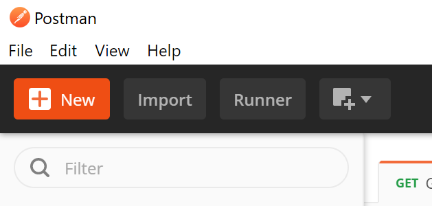

# Looking for a Dog

Solving a family dilema with serverless technologies!


## The Problem

My family has reached a tipping point: our children are demanding an addition to the family. The 12 chickens that we have been keeping is not enough: my daughter "really, really, really, really, really, really, really, really" wants a dog. She actually does not want a dog. She wants 10,000 dogs, a cat, goats, sheep, cows, horses and a giraffe. She is 7. She can dream. She has pleaded, debated, built up solid arguments, and my wife and I have caved. We are searching for 1 dog.

Here's the thing, it appears that many families are searching for dogs these days. Looking at breeder sites there is a huge backlog and increased prices with the current demand. Searching through petfinder by the time we see a new dog  pop into the list it is already gone. After finally talking to an adoption coordinator we learned that there were often 100+ applications for the dogs that we were putting out names in for. 

I talked to my wife the other day about the process and she mentioned that she can get alerted for new dogs but they only send the email out once a day so unless she is hitting refresh every 5 minutes she does not see the notification before it is too late. Hmmm... what if I could hit refresh every 5 minutes automatically?

We have been looking at petfinder.com as they hold the listings for the organizations that we have been working with and a quick search showed that they have an [API](https://www.petfinder.com/developers/)that I could call.

So here was my thought for a quick and dirty solution: write a logic app that runs every 5 minutes. From the logic app, call an Azure Functionthat uses the petfinder.com API to execute my search. If any dogs show up we have not seen yet then email those listings to us so we can take immediate action.

What I ended up with was something like this:


## Let's Start With the Function App

There main API call that we need from petfinder.com is "animals". To use this API we need to first get a bearer token and then call the API and pass our search criteria in the query string.

Here is my basic process:

* get bearer token
* search for animals
* for each item returned
  * check to see whether I have seen this animal before
  * if I have, move to the next animal
  * if I have not,
    * record the new animal in my database
    * add the animal to my results

Some things that I would like to keep in mind:

* This function will only be called once every few minutes. The API account allowed me to make 1000 calls per day.There are 1,440 minutes in a day. So I will run the function once every 2 minutes. I would like it to run "quickly" I am not concerned with eeking every ounce of performnce.
* We may want to change the search criteria from time to time. I would like to do this without pushing new code.
* I may want to make some changes and test without affecting the running app. Keep your user base in mind - my user base is my wife: thouh shalt not crash your wife's app.

I am going to be using C# for this app as I was trying to finish it in 1 night and C# is what I know best but the [Azure Function Runtime supports other languages as well.](https://docs.microsoft.com/en-us/azure/azure-functions/supported-languages)

I am going to start with a 100% local development environment.

* [Visual Studio Code](https://code.visualstudio.com/Download)
* [dotnet core SDK](https://dotnet.microsoft.com/download)
* [Azure Functions Extension for VS Code](https://marketplace.visualstudio.com/items?itemName=ms-azuretools.vscode-azurefunctions)
* [Azure Function Core Tools](https://www.npmjs.com/package/azure-functions-core-tools)
  * [Requires node and npm](https://docs.npmjs.com/downloading-and-installing-node-js-and-npm)
* [C# Extension for VS Code](https://marketplace.visualstudio.com/items?itemName=ms-dotnettools.csharp)
* [Azure CLI](https://docs.microsoft.com/en-us/cli/azure/install-azure-cli?view=azure-cli-latest)
* [Azure Storage Emulator](https://docs.microsoft.com/en-us/azure/storage/common/storage-use-emulator)
* [Azure Cosmos DB Emulator](https://docs.microsoft.com/en-us/azure/cosmos-db/local-emulator-release-notes)
* [Postman](https://www.postman.com/downloads/)

I am sure that I forgot something. If you try this out and I am missing something please let me know so I can add it to the list.

### Create your petfinder.com Developer Account

The petfinder.com developer account is tied to your user petfinder user account so you will first need to create one of those. Open a browser and navigate to www.petfinder.com and either log in or create a new account.

Once your account is created navigate  to [www.petfinder.com/developers](https://www.petfinder.com/developers/)

> Take note of a weird glitch. I used facebook authentication when I signed into www.petfinder.com. If I log into www.petfinder.com and then navigate to www.petinder.com/developers then everything is great. If I open a new brower and go straight to www.petfinder.com/developers and try and sign using facebook I get an error.

Add the bottom of the page you should see a button that says "GET AN API KEY". Click that button.

* Application Name: Get Creative
* Application URL: I just posted my company's website
* How do you plan to use the API?: I mentioned that I was searching for a family pet. I have no idea why *YOU* are here!
* Agree to the terms and enter and cofirm a password
* Click "GET A KEY"

It sohuld say "API Access Granted" if it does not, re-evaluate your life's choices.

Copy the API Key and Secret and paste them into your favorite text editor - you know, notepad.

Click on View Documentation.

In the section "[Using the API](https://www.petfinder.com/developers/v2/docs/#using-the-api)" there is a section titled "Getting Authenticated." They give you the following code snippet. How helpful of them!

``` bash
    curl -d "grant_type=client_credentials&client_id={CLIENT-ID}&client_secret={CLIENT-SECRET}" https://api.petfinder.com/v2/oauth2/token
```

Now look at the menu on the left and click on the entry that says "[Get Animals](https://www.petfinder.com/developers/v2/docs/#get-animals)"

``` bash 
    GET https://api.petfinder.com/v2/animals
```


### Explore the API

OK, so at this point you have the pre-requisites installed. Before we create the and start plugging code in, let's take a quick look at the API and make sure that we understand it. For this I use Postman.

Launch the Postman app and sign in.

In Postman we will create a new "[Collection](https://learning.postman.com/docs/postman/collections/intro-to-collections/)" and add our API calls to that collection.

Find the "New" button - and click it.



In the resulting dialog select "Collection".

In the "Create a New Collection" dialog enter a name for the collection (I used "petfinder api" but you can be a creative or mundance as you please) and click "Create".

You should now see a pane in your postman app that looks like this:


Select the elipse button (the dot dot dot) and in the popup menu select "Add Request".
