# Looking for a Dog

Solving a family dilema with serverless technologies!


## The Problem

My family has reached a tipping point: our children are demanding an addition to the family. The 12 chickens that we have been keeping is not enough: my daughter "really, really, really, really, really, really, really, really" wants a dog. She actually does not want a dog. She wants 10,000 dogs, a cat, goats, sheep, cows, horses and a giraffe. She is 7. She can dream. She has pleaded, debated, build up solid arguments - my wife and I have caved. We are getting a dog... 1 dog.

Here's the thing, it appears that many families are searching for dogs these days. Looking at breeder sites there is a huge backlog and increased prices with the current demand. Searching through petfinder by the time we see a new dog  pop into the list it is already gone. After finally talking to an adoption coordinator we learned that there were often 100+ applications for the dogs that we were putting out names in for.

I talked to my wife the other day about the process and she mentioned that she can get alerted for new dogs but she only receives the email once a day. Unless she is hitting refresh every 5 minutes she does not see the notification before it is too late. Hmmm... what if I could hit refresh every 5 minutes automatically?

We have been looking at petfinder.com as they hold the listings for the organizations that we have been working with and a quick search showed that they have an [API](https://www.petfinder.com/developers/)that I could call.

So here was my thought for a quick and dirty solution: write a logic app that runs every 5 minutes. From the logic app, call an Azure Function that uses the petfinder.com API to execute my search. If any dogs show up we have not seen yet then email those listings to us so we can take immediate action.

What I ended up with was something like this:
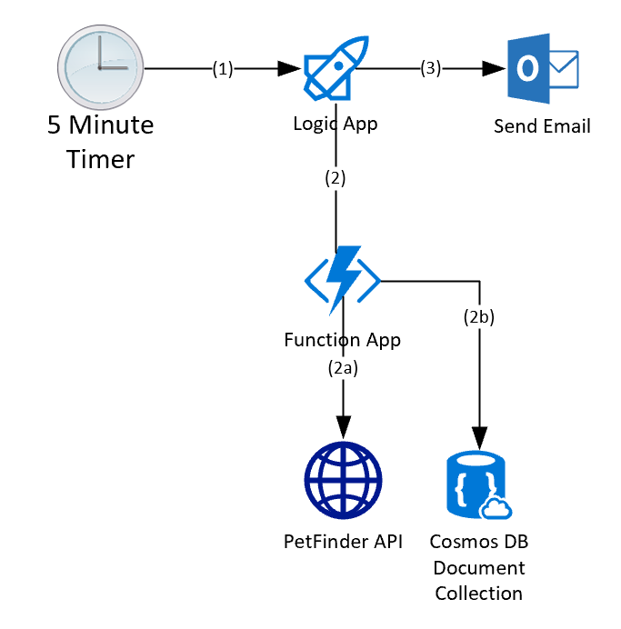

## Create your petfinder.com Developer Account

The first thing that I did was take a look at the petfinder.com API. The petfinder.com developer account is tied to your user petfinder user account so you will first need to create one of those. Open a browser and navigate to [www.petfinder.com](www.petfinder.com) and either log in or create a new account.

Once your account is created navigate  to [www.petfinder.com/developers](https://www.petfinder.com/developers/)

> Take note of a weird glitch. I used facebook authentication when I signed into www.petfinder.com. If I log into www.petfinder.com and then navigate to www.petinder.com/developers then everything is great. If I open a new brower and go straight to www.petfinder.com/developers and try and sign using facebook I get an error.

At the bottom of the page you should see a button that says "GET AN API KEY". Click that button.

| Field Name | Value |
|------------|-------|
| Application Name | Get Creative |
| Application URL |I just posted my company's website |
| How do you plan to use the API? | I mentioned that I was searching for a family pet. I have no idea why *YOU* are here! |
| Terms and Contitions | Agree to the terms |
| PAssword | You know what to do |
| "GET A KEY" | Click it |

You should see a message that says "API Access Granted" if it does not, re-evaluate your life's choices.

Copy the API Key and Secret and paste them into your favorite text editor - you know, notepad.

Click on View Documentation.

In the section "[Using the API](https://www.petfinder.com/developers/v2/docs/#using-the-api)" there is a section titled "Getting Authenticated." They give you the following code snippet. How helpful of them!

``` bash
    curl -d "grant_type=client_credentials&client_id={CLIENT-ID}&client_secret={CLIENT-SECRET}" https://api.petfinder.com/v2/oauth2/token
```

Now look at the menu on the left and click on the entry that says "[Get Animals](https://www.petfinder.com/developers/v2/docs/#get-animals)"

``` bash
    GET https://api.petfinder.com/v2/animals
```

OK - you now have a developer account for www.petfinder.com!

## Explore the API

At this point you have the pre-requisites installed. And you have created your developer account for petfinder.com. Before we create the project and start plugging in code, let's take a quick look at the API and make sure that we understand it. For this I use Postman.

* [Postman](https://www.postman.com/downloads/)

Launch the Postman app and sign in.

In Postman we will create a new "[Collection](https://learning.postman.com/docs/postman/collections/intro-to-collections/)" and add our API calls to that collection.

Find the "New" button - and click it.


In the resulting dialog select "Collection".

In the "Create a New Collection" dialog enter a name for the collection (I used "petfinder api" but you can be a creative or mundane as you please) and click "Create".

You should now see a pane in your postman app that looks like this:
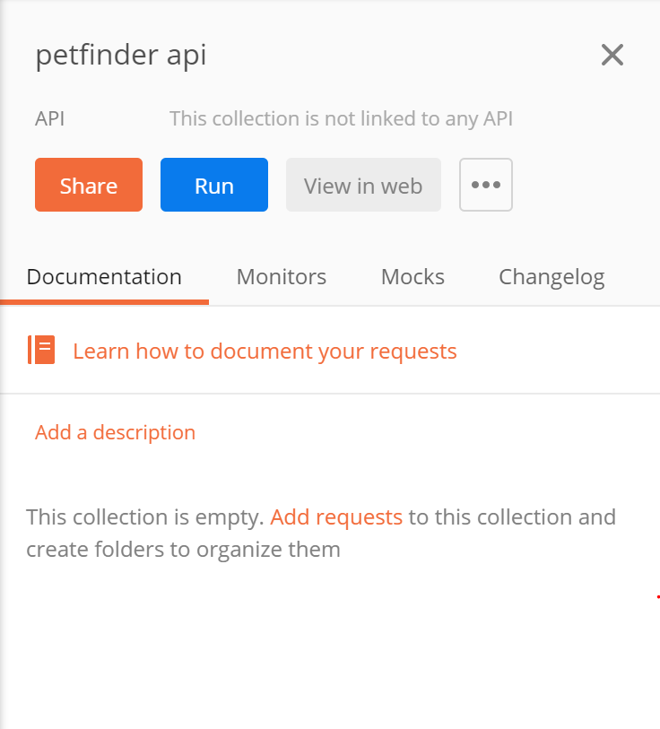

Select the elipse button (the dot dot dot) and in the popup menu select "Add Request".

I called my request "Get Token" because I am boring - call it what you will.

Click the button that says "Save to \<your collection name>"

In the left hand navication pane you should see something like:

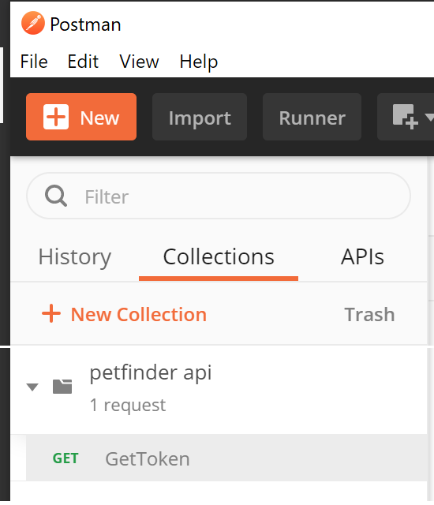

Click on "GetToken" to modify the request.

Some of you are advanced Postman users and are setting up variables and environments and all that. We are going to go simple here.

You should see something like:
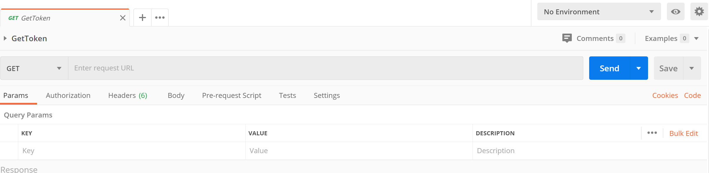

Where it says "Enter Request URL" enter "https://api.petfinder.com/v2/oauth2/token". And select "POST" for the call's method.

Select the Authorization Tab on the request and enter your UserName and Password. Oh, what's this? You havent told me about username and password. In the username box enter the "API Key" that you colied in the previous section (the one that you securely stashed away in notepad). Under password, enter the "Secret."

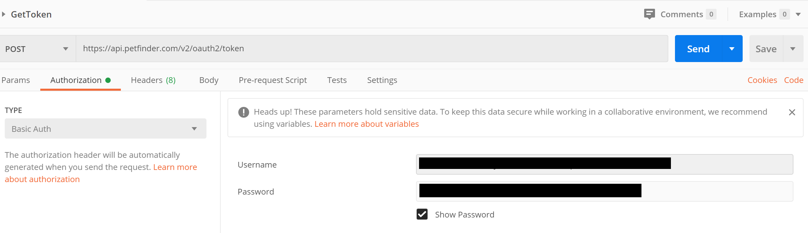

The final part of this call species that we need are looking for client credentials. We will do that by passing this information in the body of the call. Select the "Body" tab and the option "x-www-form-urlencoded" and enter a key value pair: "grant-type" and "client_credentials".

With this information entered, click "Send" and you will see your token the response body.

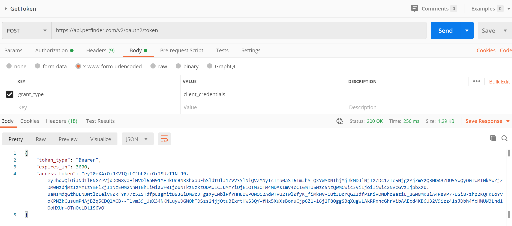

Now that we have the token we can call the animals API and execute a search.

Add another request to the collection. I called mine "Search Animals."

The URL for the "animals" API call is [https://api.petfinder.com/v2/animals](https://api.petfinder.com/v2/animals).

In the authorization tab select "Bearer Token" and enter the value of the access_token field from the get token response.

In the "Params" tab you can enter your search parameters and they will create the URL query string.

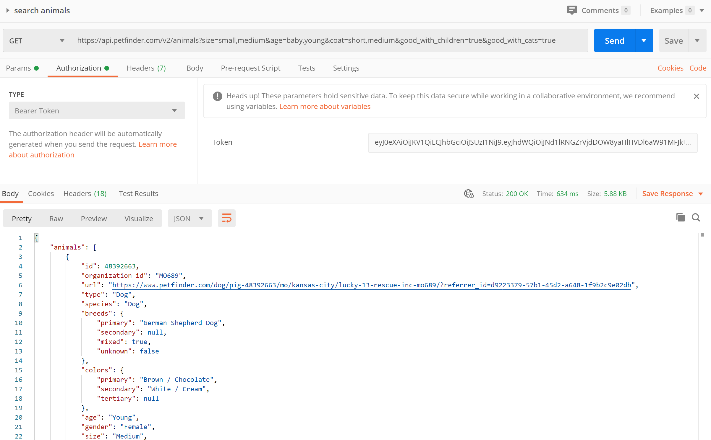.

## Let's Start With the Function App

The main API call that we need from petfinder.com is "animals". To use this API we need to first get a bearer token and then call the API and pass our search criteria in the query string.

Here is my basic process:

* get bearer token
* search for animals
* for each item returned
  * check to see whether I have seen this animal before
  * if I have, move to the next animal
  * if I have not,
    * record the new animal in my database
    * add the animal to my results

Some things that I would like to keep in mind:

* This function will only be called once every few minutes. The API account allowed me to make 1000 calls per day.There are 1,440 minutes in a day. So I will run the function once every 2 minutes. While I would like it to run "quickly" I am not concerned with eeking out every ounce of performnce.
* We may want to change the search criteria from time to time. I would like to do this without pushing new code.
* I may want to make some changes and test without affecting the running app. Keep your user base in mind - my user base is my wife: thouh shalt not crash your wife's app.

I am going to be using C# for this app as I was trying to finish it in 1 night and C# is what I know best but the [Azure Function Runtime supports other languages as well.](https://docs.microsoft.com/en-us/azure/azure-functions/supported-languages)

I am going to start with a 100% local development environment (well, aside from the actual petfinder.com API).

* [Visual Studio Code](https://code.visualstudio.com/Download)
* [dotnet core SDK](https://dotnet.microsoft.com/download)
* [Azure Functions Extension for VS Code](https://marketplace.visualstudio.com/items?itemName=ms-azuretools.vscode-azurefunctions)
* [NuGet Extension for VS Code](https://marketplace.visualstudio.com/items?itemName=jmrog.vscode-nuget-package-manager)
* [Azure Function Core Tools](https://www.npmjs.com/package/azure-functions-core-tools)
  * [Requires node and npm](https://docs.npmjs.com/downloading-and-installing-node-js-and-npm)
* [C# Extension for VS Code](https://marketplace.visualstudio.com/items?itemName=ms-dotnettools.csharp)
* [Azure CLI](https://docs.microsoft.com/en-us/cli/azure/install-azure-cli?view=azure-cli-latest)
* [Azure Storage Emulator](https://docs.microsoft.com/en-us/azure/storage/common/storage-use-emulator)
* [Azure Cosmos DB Emulator](https://docs.microsoft.com/en-us/azure/cosmos-db/local-emulator-release-notes)

I am sure that I forgot something. If you try this out and I am missing something please let me know so I can add it to the list.

## Create a Function App - Part 1 - Executing the Search

There are a few paths that you could take here. I am going to do the work right in Visual Studio Code.

I generally have a projects directory on my C:\ drive and start with the command line.

``` powershell
> cd C:\projects
> mkdir petfinderSearch
> cd petFinderSearch
> mkdir funcs
> code .
```

This will launch VS Code and open the current directory.

On the left of your screen you should see an icon for Azure. When you click that you should see navigation panes various Azure extensions thaty you have installed. One of those will be Azure Functions.

When you look in the Azure Functions list you will see the list of Azure Subscriptions that you have access to.

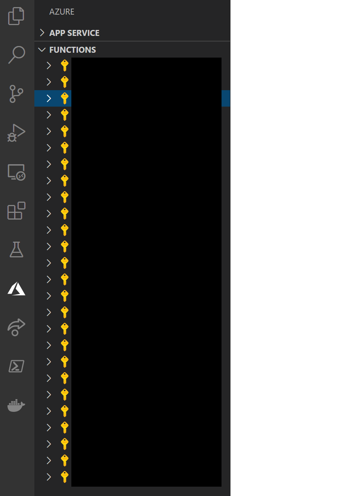

Hover your cursor next to the word "functions" and you will see a few icons appear. The one we are interested in is the first one "Create a new Project".

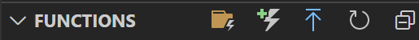

This will launch the wizard to create a new function app porject and add the first function. The values I used were:

| Prompt | Value |
| ------ | ----- |
| Directory | Browse to the funcs directory we created |
| Launguage | C# |
| Template | httpTrigger |
| FunctionName | SearchForNewPets |
| Namespace | PetFinderSearch |
| AccessRights | Function |

You should see a new .cs file with the scaffolding code for a new function called SearchForNewPets.

At the bottom-right of the screen a popup will ask you if you want to restore packages to incude any missing dependancies - click restore. Then build the project with Ctrl-Shift-B.

If you want, you can run this "Hello World" example by choosing the menu option "Run->Start Debugging". This will launch the local function runtime and you will see a URL in the output that you can click to call your function.

Let's take a look at some of the attributes in this function's header:

``` cs
  [FunctionName("SearchForNewPets")]
  public static async Task<IActionResult> Run(
      [HttpTrigger(AuthorizationLevel.Function, "get", "post", Route = null)] HttpRequest req,
      ILogger log)
```

Typically C# function with a couple of new attributes that the function runtime uses to understand how this function should operate within the context of the function runtime. These "bindings" dictate how the function will be triggered (trigger bindings), what data sources the function will read from (input bindings) and write to (output bindings).

In this case we have an HttpTrigger binding. When the runtime sees an http get or post request at the URL designated for this function, the function code will be executed. Information about the http request will be available to the function in the parameter that is annotated with this httpTrigger attribute.

In this case we have no input or output bindings, we will add them later.

The other parameter is a logger that we can use to log information to the appropriate output. The logger is provided to us by the function runtime.

Let's add the code to get out bearer token and execute a search.

Back in Postman, navigate to your GetToken call. Under the send button you will see the word "Code". Click that link and in the pop dialog look at the code for "C# - RestSharp". This is an example call syntax for this API using a library ReshSharp that we can add to our project.

1) Add ` using RestSharp; ` to your usings block at the top of your .cs file.
2) Add the RestSharp NuGet package to your project.
   1) Hit Ctrl-shift-P for the command palette.
   2) Tyep Nuget and select "Nuget Package Manager: Add Package"
   3) Type "RestSharp for the package name and select RestSharp from the resulting list.
   4) Select a version. I chose "106.11.4"
3) Add the following code - basically the code from Postman. The only real changes are that I added the logging information and moved the loginUri and apiKey to environment variables and used the Async verison of Execute to execute the request asynchrnousky.

``` cs
        private static async Task<string> GetToken(ILogger log)
        {
            log.LogInformation("Getting Token");
            string logonUri = Environment.GetEnvironmentVariable("LogonUri");
            string apiKey = Environment.GetEnvironmentVariable("ApiKey");
            var client = new RestClient(logonUri);
            client.Timeout = -1;
            var request = new RestRequest(Method.POST);
            request.AddHeader("Authorization", $"Basic {apiKey}");
            request.AddHeader("Content-Type", "application/x-www-form-urlencoded");
            request.AddParameter("grant_type", "client_credentials");
            IRestResponse response = await client.ExecuteAsync(request);

            dynamic responseObj = JsonConvert.DeserializeObject(response.Content);
            //Console.WriteLine(response.Content);
            log.LogInformation("Token Generated");
            return responseObj.access_token;
        }
```

Since I am looking for these two variables from my environment variables, where do i set those? The function runtime will read configuration settings and expose them to your code as environment variables. Open up your localsettings.json file. Add the LogonUri and ApiKey values and it should look like this:

``` json
{
  "IsEncrypted": false,
  "Values": {
    "AzureWebJobsStorage": "",
    "FUNCTIONS_WORKER_RUNTIME": "dotnet",
    "LogonUri": "https://api.petfinder.com/v2/oauth2/token",
    "ApiKey": "<your api key>"
  }
}
```

If I were actually developing a production solution I would store this key in Azure Key Vault along with other secrets that we are going to discuss in this sample; however. Maybe I will modify this post if I ever search for another dog.

Let's take a look at Execute Search.

``` cs
        private static async Task<string> ExecuteSearch(string token, ILogger log)
        {
            log.LogInformation("Executing Search");
            string searchUri = Environment.GetEnvironmentVariable("searchUri");
            string searchQuery = Environment.GetEnvironmentVariable("searchQuery");
            log.LogInformation($"searchQuery = {searchUri}{searchQuery}");
            var client = new RestClient($"{searchUri}{searchQuery}");
            client.Timeout = -1;
            var request = new RestRequest(Method.GET);
            request.AddHeader("Authorization", $"Bearer {token}");
            IRestResponse response = await client.ExecuteAsync(request);
            //Console.WriteLine(response.Content);
            log.LogInformation("Serach Complete");
            return response.Content;

        }
```

Again, pretty much the same code that Postman gave me. I like it when others write my code for me! I added the logging and externalized my Uri and searchQuery and used the async method. The new Localsettings.json file like liek this.

``` json
{
  "IsEncrypted": false,
  "Values": {
    "AzureWebJobsStorage": "",
    "FUNCTIONS_WORKER_RUNTIME": "dotnet",
    "LogonUri": "https://api.petfinder.com/v2/oauth2/token",
    "ApiKey": "TXdZUTRma1Y3QzlvMmh5R1Q5emlvdTBSZFJ0TUV4cWlBYUpXbVJSdWVVd2JTYkFWTDc6TzZsQldrNUxqbndBckRRV083WjZBSjRCWlhwTzluZTFiQ1Q3VG1aRA==",
    "searchUri": "https://api.petfinder.com/v2/animals",
    "searchQuery": "?type=dog&size=small,medium&age=baby,young&coat=short,medium&good_with_children=true&sort=recent"
  }
}
```

Let's test out this call.

I updated the entrypoint function to:

``` cs
        [FunctionName("SearchForNewPets")]
        public static async Task<IActionResult> Run(
            [HttpTrigger(AuthorizationLevel.Function, "get", Route = null)] HttpRequest req,
            ILogger log)
        {
            log.LogInformation("C# HTTP trigger function processed a request.");

            string token = await GetToken(log);
            string searchResults = await ExecuteSearch(token, log);

            return new OkObjectResult(searchResults);
        }

```

Then set a breakpoint on the first line in the function and hit F5 to build and run the code in the debugger. You can step through the code or just run it and trust that it works! The ouput should be a web page full of JSon - the listing of all the pets that matched the search.

So this is great so far, but I only want to see results that I have not yet seen. So how can we record the animals that were returned. There is almost an endless list of datastores that we could use for this purpose. CosmosDB is what I went with.

## Configuring Your Local CosmosDb Environment

Remember that CosmosDb Emulator that you installed in the pre-requisites? In your start menu search for Cosmos, select "Azure Cosmos DB Emulator" and open it. After a few moments you will see a notification that the emulator has started, and a web page will pop up with the Azure Cosmos DB Emulator and data explorer web page. On the left hand side of the page open the Explorer tab and click "New Container".

| Parameter | Value |
|-----------|-------|
| Database id | Create New, petSearchDb |
| Proivision Database Throughout | checked |
| Throughput | 400 |
| Ccontainer id | pets |
| Partition key |  /petId |

Now we have to tell our function how we want to interact with this database.

## Add Database Connectivity to Your Function

Follow the steps to add a NuGet package for

* Newtonsoft.Json
* Microsoft.Azure.WebJobs.Extensions.CosmosDB

We will also need to add three settings to our local.setting.json file. You can get your connection string from the quickstart tab of the Cosmos DB Emulator web page at [https://localhost:8081/_explorer/index.html](https://localhost:8081/_explorer/index.html)

``` json
    "CosmosDbConnection": "AccountEndpoint=https://localhost:8081/;AccountKey=<account_key>",
    "DbName": "petSearchDb",
    "CollName": "pets"
```

Back in your entry point function:

``` cs
        [FunctionName("SearchForNewPets")]
        public static async Task<IActionResult> Run(
            [HttpTrigger(AuthorizationLevel.Anonymous, "get", Route = null)] HttpRequest req,
            [CosmosDB(
                databaseName: "%DbName%",
                collectionName: "%CollName%",
                ConnectionStringSetting = "CosmosDBConnection")] DocumentClient petsClient,

             [CosmosDB(
                databaseName: "%DbName%",
                collectionName: "%CollName%",
                ConnectionStringSetting = "CosmosDBConnection")]
                IAsyncCollector<dynamic> petsOut,
            ILogger log)
        {
            try
            {

                string dbName = System.Environment.GetEnvironmentVariable("DbName");
                string collName = System.Environment.GetEnvironmentVariable("CollName");

                log.LogInformation("C# HTTP trigger function processed a request.");

                //
                // Get my bearer token and execute search against petfinder api
                //
                string token = await GetToken(log);
                string searchResult = await ExecuteSearch(token, log);

                //
                // convert search result to collection of dynamic objects
                //
                dynamic pets = JsonConvert.DeserializeObject(searchResult);

                //
                // Get a reference to my cosmosdb document collection
                //
                Uri collectionUri = UriFactory.CreateDocumentCollectionUri(dbName, collName);

                //
                // list to keep track of new pets
                //
                List<dynamic> newPets = new List<dynamic>();

                //
                // for each pet in the search results
                //
                foreach (dynamic pet in pets.animals)
                {
                    log.LogInformation($"{pet.id}:{pet.name}");

                    //
                    // check to see if we have seen this pet before
                    //
                    var query = petsClient.CreateDocumentQuery(collectionUri, $"select * from c where c.petId = '{pet.id}'").AsEnumerable();
                    if(query.FirstOrDefault() != null)
                    {
                        //
                        // we've already seen this one.. move on
                        //
                        log.LogInformation("Pet Found");
                    }
                    else
                    {
                        //
                        // we have not seen this pet -- add it to cosmosdb and the collection that we will return to the caller
                        //
                        log.LogInformation("Adding Pet");
                        dynamic newPet = new System.Dynamic.ExpandoObject();
                        newPet.id = pet.id.ToString();
                        newPet.petId = pet.id.ToString();
                        newPet.name = pet.name;
                        newPet.description = pet.description;
                        newPet.primaryBreed = pet.breeds.primary;
                        newPet.secondaryBreed = pet.breeds.secondary;
                        newPet.url = pet.url;

                        var photos = new List<dynamic>();
                        foreach(var photo in pet.photos)
                        {
                            photos.Add(photo.full);
                        }

                        newPet.photos = photos;

                        await petsOut.AddAsync(newPet);
                        newPets.Add(newPet);
                    }

                }

                // return the list of new pets
                return new OkObjectResult(newPets);
            }
            catch(Exception e)
            {
                log.LogError(e.Message);
                log.LogError(e.ToString());
                return new BadRequestObjectResult(e.ToString());
            }
        }
```

Let's start with the two new parameters we added to the function:

``` cs
            [CosmosDB(
                databaseName: "%DbName%",
                collectionName: "%CollName%",
                ConnectionStringSetting = "CosmosDBConnection")] DocumentClient petsClient,

             [CosmosDB(
                databaseName: "%DbName%",
                collectionName: "%CollName%",
                ConnectionStringSetting = "CosmosDBConnection")]
                IAsyncCollector<dynamic> petsOut,
```

The first, petsClient is an input binding. When my function executes the function runtime will create a connection to CosmosDb and expose that connection as a DocumentClient named petsClient. The connection information is embedded in the CosmosDb attribute attached to the parameter.

The second parameter exposes a collection that I can add objects to. Those objects will be written to the container that we just created in CosmosDb.

[There are a number of ways that we can interact with CosmosDb and other data stores through these attributes.](https://docs.microsoft.com/en-us/azure/azure-functions/functions-triggers-bindings).

The rest of the function is not really function specific, its just C#. Granted, my code could be a little tighter. I could allow further parameterization of the search in the request. I could limit my search results or change the search so that I look at the last time I ran the query and only retrieve new pets since that time. But for this exersize, I just needed something simple.

I am handling no errors... but my customers here are me and my wife. If not handling an error when calling the petfinder api or adding a document to a collection is the thing that get's me in trouble I think I am having a pretty good day!

So that's the function, test it out. You can also very the search parsmeters in your settings file and try some different search fields. They are documented in the petfinder api documentation.

You can visit that Cosmos DB Emulator page and mavigate to the data explorer tab to look at the data that you are writing to the database.

## Deploy the function to Azure

Remember back when we created this function project using the Azure tab on the left hand side of VS Code? First, find the Azure logo

and hover next to the word functions to pop up this set of buttons
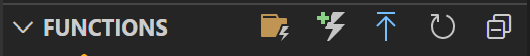 and click the blue upward facing arrow. This will initiate the deploy to Function App wizard.

You can also deploy through the command line, the Azure Portal, DevOps Pipeines, GitHub Acions, you cuold call REST APIs directly. I am using VS Code Wizard here for brevity. And then ruining my breity choice by explaining it.

The Wizard Stetps are:

* Select a Subscription - pick a subscription that you have access to. You will need access to create a resource group and deploy resources to that group.
* You can deploy to an existing app or create a new one. We will create a new one. Select "+ Create new Function App in Azure..." (I did not choose the advanced option. It gives you a litle more control).
* Function App Name. This needs to be a globally unique name. I often prefix my globally unique names with andyrob. In this case I chose andyrob-petfinder-func
* Location - choose a location. I choose East US because I am an East coast kind of guy but hey, you do you.

This'll take a couple of minutes. Take a bio break, get up and stretch, check some email.

Now navigate to the [Azure Portal](https://portal.azure.com) and find the resource group you just created. We still need to create our CosmosDb account and add our app settings.

If you used the simple wizard like I did, the resource group will be the name of the function app with any special characters removed. In my case, this is andyrobpetfinderfunc.

I am not going to add a step by step process to create a cosmosdb account but here is some documentation:
[Add a Cosmos Db Account](https://docs.microsoft.com/en-us/azure/cosmos-db/how-to-manage-database-account) - ALso, a good idea select the same region you chose for the function app. Your code will execute even if CosmosDb is on the other side of the world, but why make everyone work so hard. You can use the free tier here as long as you do not have another free tier cosmos db account in your subscription.

[Create a Continer](https://docs.microsoft.com/en-us/azure/cosmos-db/how-to-create-container). You should select the SQL API. Well, at least if you want your code to execute. You can use the minimum throughout setting 400 RUs and use the same names, partitioning keys, etc as we did for the local Cosmos DB database.

To the left of the data exploter look for the "Settings" section and click on "Keys". Copy the "Primary Connection String" and save for later.

Head back to your resource group and click on your "App Service". This is your function app. Under the "Setting" section on the left select "Configuration".

We will need to add 7 application settings. You can do this with the "+ Application Setting" button at the top of the configutation page. The settings we will add are: LogonUri, ApiKey, searchri, searchQuery, CosmosDbConnection, DbName, CollName. All of these values will be the same as your local settings except for the CosmosDbConnection which should contain the value that you just copied from your Azure Cosmos Db.

Make sure to click "Save" at the top of the page before you leave this screen!

Under the "Functions" section on the left click "Functions". Click on your "SearchForNewPets" function. Click on "Get Function Url" at the top of the page, copy the results and save for later.

If you click on "Code and Test" you can execute the function and connect to the logstream to see the information that we were logging.

Awesome! We have a function running in Azure. Next step, we can add a logic app to call this function on a timer and email the results.

## Add a New Logic App

Add a new Logic App resource to your resource group. The settings for the Logic App are:

| Setting | Value |
| ------- | ----- |
| Subscription | Your Subscription |
| Resource Group | The Resource Group with your Function App |
| Logic App Name | Globally Unique Name - I used andyrob-petfinder-logic |
| Region or Integration Service Environment | We will use a regional deployment. ISE is a choice for dedicated capacity and isolated networking. |
| Location | East US for me |
| Log Analytics | Off unless you want to explore log analytics! |

Open up your Logic App. We will use a template that executes our logic app on a timer trigger.
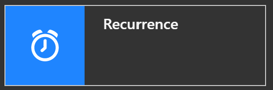

I want this app to run every two minutes:
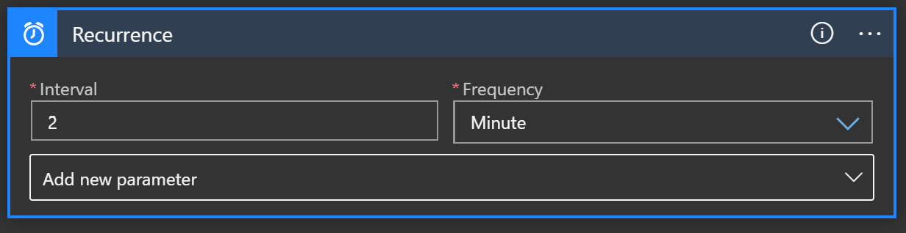

On the two minute mark I would like to call my function. Add a new step and select the HTTP action. Configure the request as a GET request to the Function URL that you copied earlier.

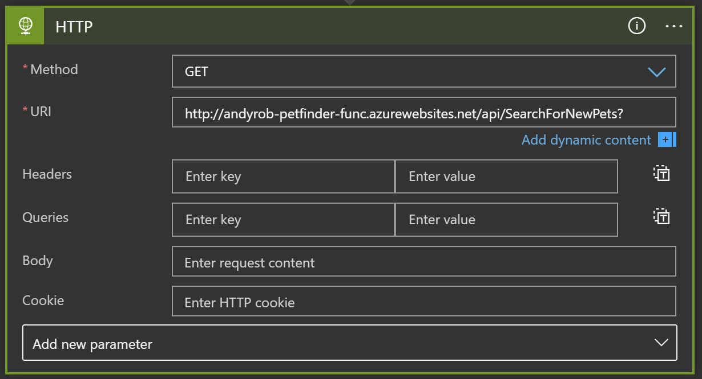

We want to iterate through the results of the search and send an email for each item.

Add a new step. In the search box type "for each" and in the categories select "Control"

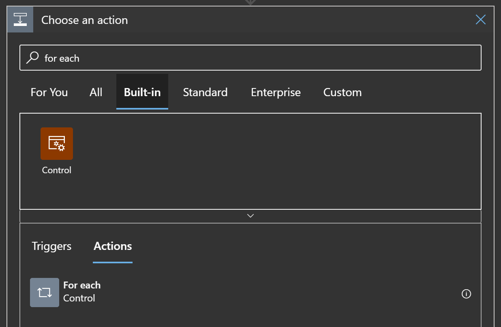

In the for each archion click int he text box "Select an output from previous steps". In the dynamic content window click "See More".

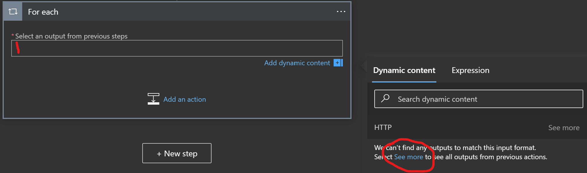

Select "Body" which is the http result of the http action.

For each result item we would like to send an email. Inside the "For Each" action click the "Add and Action" button. I am going to send an email using Office365. The same basic approach will work with other email services. In the "Add an Action" dialog search for "Office 365" and, select the "Office 365" category. In the list of actions in find "Send an Email (V2)".

For now, in the to line, enter your email address. In the subject line look at the dynamic content dialog. Selct "Expression" from the top of the dialog and enter ``` concat('New Pet Found: ', item().name) ```

The logic app has converted our Json response to an array of objects. item() returns the current item from our ofreach loop. And then we look for the 'name' property on that object.

In the body of the message type "yipee". We will work on the body shortly.

Test the app by clicking "Save" and then "Run" at the top of the logic app window.

You should see a couple of emails come through with new pet results.

Looking at my search results the image field is a URL to an email on the petfinder site. I would like to include these images in my email body which means I would like to send the message as HTML. The "Send Email V2" action will not automatically send an html message. If I type "```<H2>Yipee</H2>```" in the body I would get a big bold <H2>Yipee</H2> I will get and email with the text "```<H2>Yipee</H2>```". Now, I am not UI-guy but I don't think that's what I want.

Oh, by the way, you are probably seeing a munch of emails come through as you are reading this. Id you close the logic app designer in the top right of the window, it will take you back to the logic app overview page. Click on "Disable" on the top of the page if you would like to mute the emails.

This is a little odd, but if I create some dynamic HTML content and set the body of the email to the dynamic content the HTML content will render as you would expect. How will we define some dynamic HTML content? We can use variables within logic apps.

Back above the for each loop look you should see a + sign that allows you to inject an action. Click the plus sign and select "Add an Action". Search for "Initialize Variable". Slect the "Initialize variable" action.

| Name | Value |
| ---- | ----- |
| Name | emailBody |
| Type | String |
| Value | < blank > |

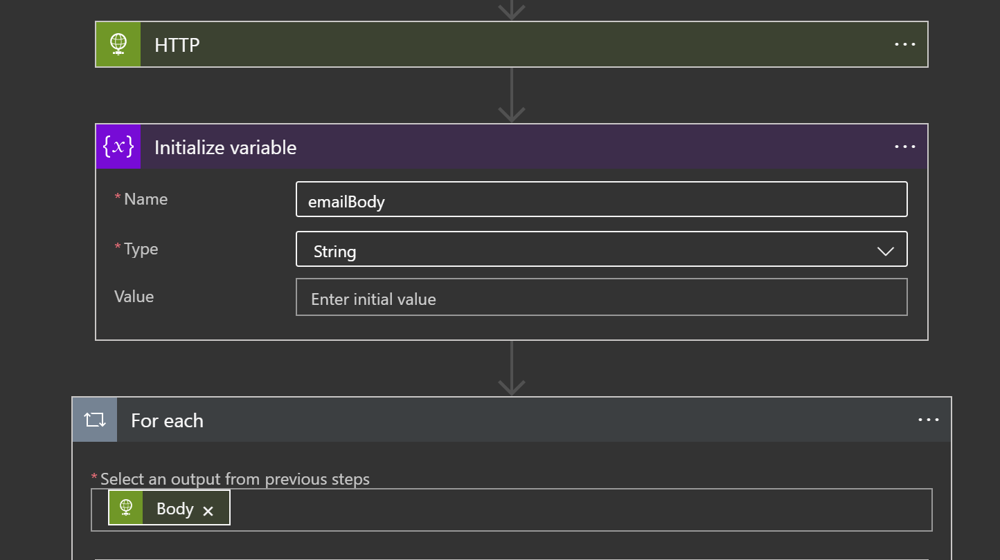

Inside the For each Loop below the "Send an email" action hit the plus and add an action. Search for "Set Variable". Note that you receive a warning about setting the concurrency control for the loop.

By default the for each loop will parallelize. The problem is that the logic app only has one instance of your emailBody variable so if we execute loop iterations in paarallel we will get some wonky behavior. Like 10 messages with the same body ... just guessing ... I never made that mistake myself! To change this behavior hit the elipses in the for each loop header and choose settings. In the settings dialog set the concurrency control to "on" and the degree of parallelism to 1. Then click done.

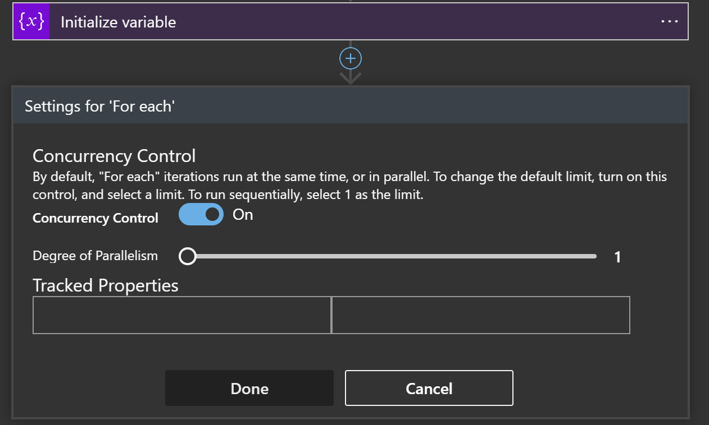

If I was dealing with larger result sets maybe I would think of other way around this like a collection of email bodies. But for this app, serializing the process will be fine.

Now, we put the "Set Variable" action below the "Send email" but we want to to run first. You can re-arrange the actions by dragging the Send Email" to below the Set Vaiable."

My "Set Variable" action looks like this:
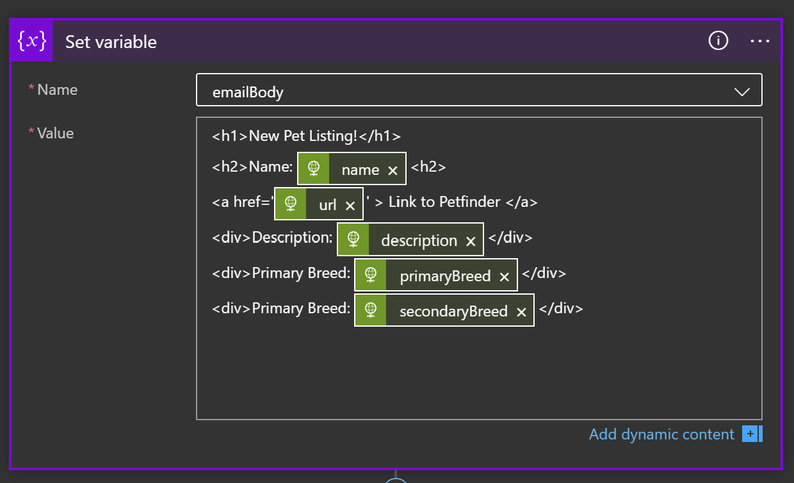

Each of the elements of dynamic content is an expression such as ```item().name``` or ```item().primaryBreed```. The dynamic content icons may look different for you. When you save and re-open the icons will change to match what you see here.

Now, the whole reason we wanted to add HTML content was to get the images but we dont have images yet.

In between the "Set Variable" action and the "Send Email" action add another for each loop. The loop collection will be the expression ```ite().photos```.

Add an action to this inner loop "Append to String Variable". Variable name is "emailBody" and value is "\". Note that you can just paste this text into the value and it will automatically convert the epression to dynamic content.

Youe main forach loop should now look like:
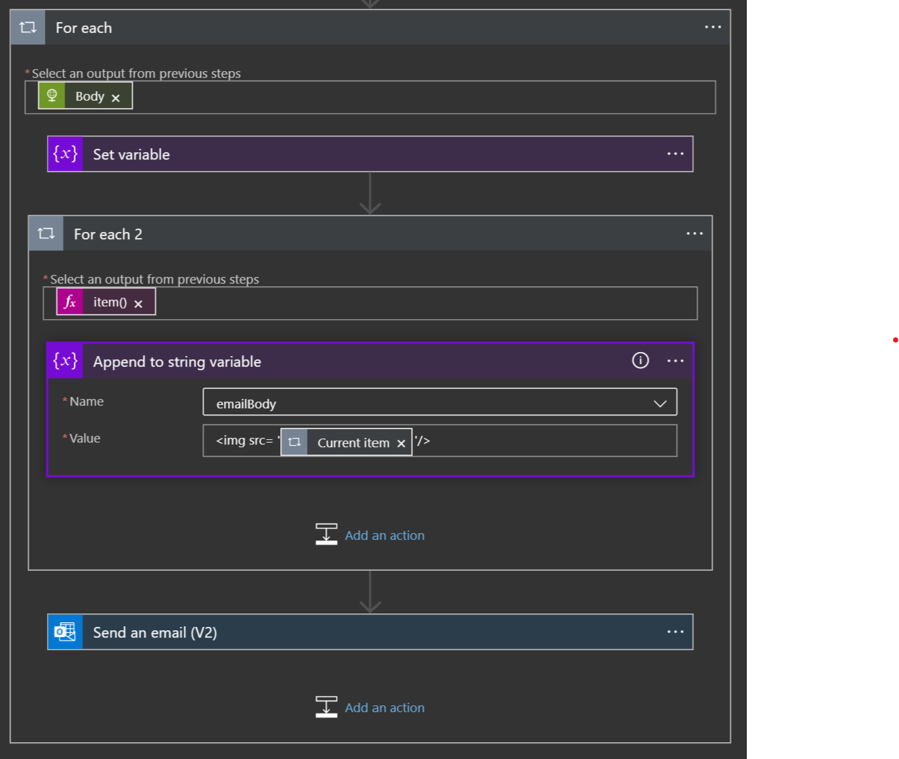

Lastly, we set the email body to our variable.

The final logic app looks like this: 
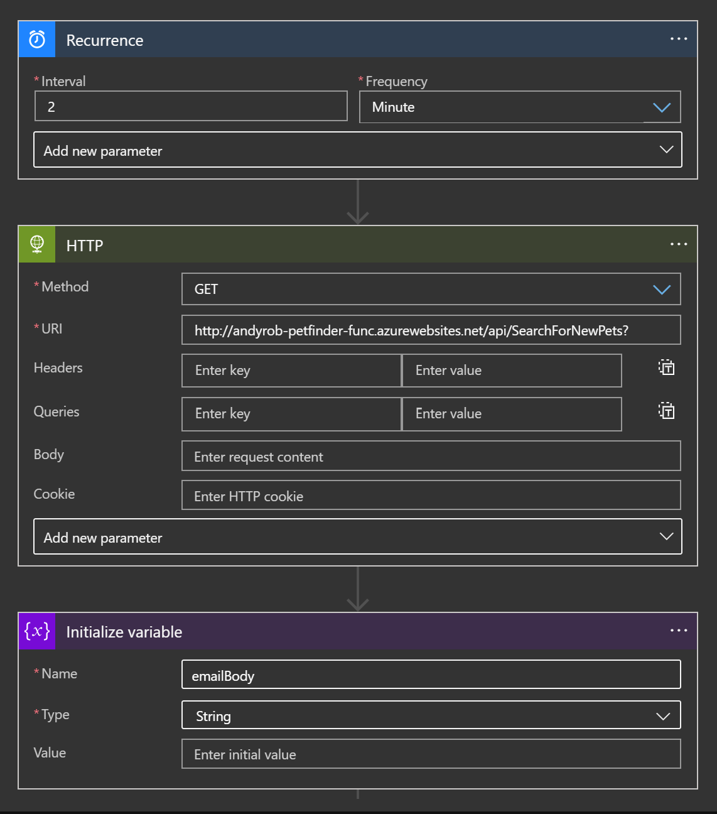
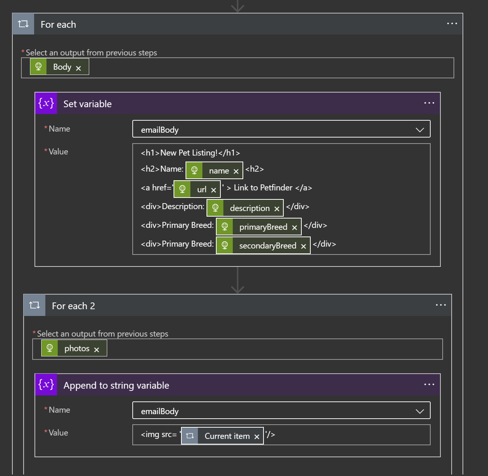
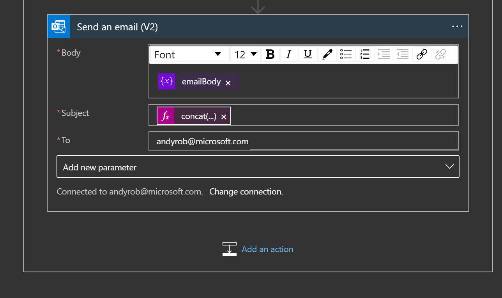

## Conclusion

So there you have it. You have a logic app that runs every couple minuets and calls your function app. The function app calls the petfinder API and tracks results in a cosmos db database.

So what happened? 1 day into running the app my wife was able to get inquiries into agencies much more quickly. 2 days after the app went live we had some solid leads and 3 days after we went live we brought home a 2 year old lab/terrier mix.

I wanted to call her hack-hound or Azure Mutt but I was overridden as my kids had no idea what I was talking about -- they will learn. So Lucky it is.


Even in this simple app there are a ton of areas left to explore:

1) I mentioned Azure Keyvault for secret storage
2) Right now my wife needs to craft an emil to respond to a dog. What if she could have just clicked on an approval button to send an email saying she was interested?
3) Add the logic app to my solution. Right now it is just manually created in the azure portal but all of that is scriptable.
4) Automatic deployments? Github actions for example would allow us to publish the function and logic apps when code changes.
5) A better picture of Lucky. I mean really, that's what it's all about, right?

I hope you enjoyed this article and maybe learned a couple of things. I welcome any and all feedback. Feel free to fork this repo and try something on your own. If you have an interesting twist or some new functionality that you would like to share I could look at integrating or if you are public I can link to your repo.